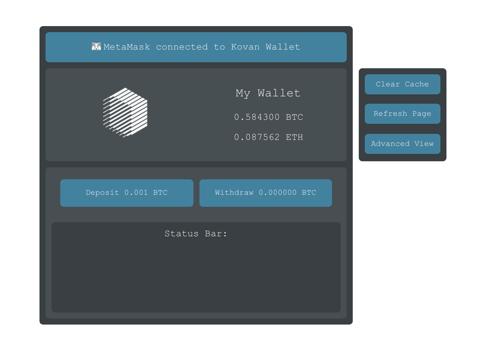
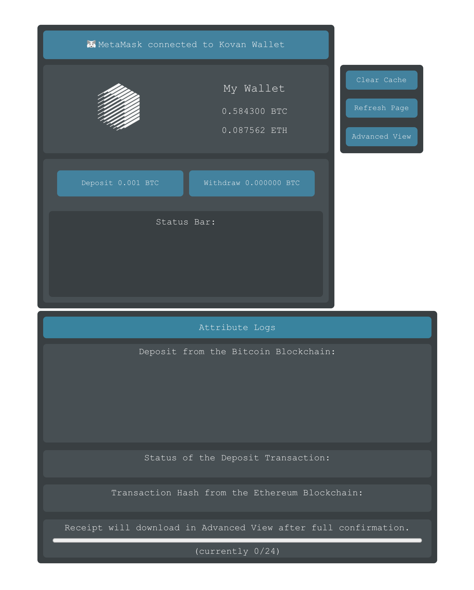

# Prototype Tokenizing Wallet

## 1. Introduction
This project is an prototype how Bitcoin can be tokenized on Ethereum. It can be executed in modern browsers which are connected to MetaMask on the Kovan testnet. [RenProject](https://renproject.io) is used for tokenizing.

RenProject offers two ways of usage: **GatewayJS** and **RenJS**. While the Gateway is used to grant easy access into the technology featuring expanded caching and a prebuild frontend overlay, it not the best option for developers who want to integrate the technology in lightway wallets with few overhead. Therefore, RenProject offers a light standard version called RenJS, which features the bare minimum to introduce the thechnology and is also used within this wallet.

Guides used to integrate software:
* [RenProject Developer Docs](https://docs.renproject.io/developers/)
* [MetaMask Developer Docs](https://docs.metamask.io/guide/)
* [ReactJS Documentation](https://reactjs.org/docs/getting-started.html) 

Programming Languages:
* Solidity (Smart Contract)
* JavaScript (Browser Wallet)

Script Languages:
* HTML (React Rendering)
* CSS (Formatting/Animation)

## 2. Showcase



## 3. Setup
[](https://www.npmjs.com/) [](https://nodejs.org/en/)

### 3.1 Preparation
The Application will need **npm** and **Node.js** installed on the machine. Follow these steps [here](https://www.npmjs.com/get-npm) to get ready.

### 3.2 Installation
``` git clone [this project]```<br/>
``` cd ./renwallet ```<br/>
``` npm install --save web3 ```<br/>
``` npm install --save @renproject/ren ```<br/>
``` npm install ```

### 3.3 Start the Application
```cd ./[project_root]```<br/>
```npm run start```

The Application is now running at
 `localhost:3000`

To stop the Application use `Ctrl+C` in Terminal

## 4. Avalable Developer Scripts

#### `npm start`
Runs the app in the development mode. Open [http://localhost:3000](http://localhost:3000) to view it in the browser. The page will reload if you make edits. You will also see any lint errors in the console.

#### `npm test`
Launches the test runner in the interactive watch mode. See the section about [running tests](https://facebook.github.io/create-react-app/docs/running-tests) for more information.

#### `npm run build`
Builds the app for production to the `build` folder. It correctly bundles React in production mode and optimizes the build for the best performance. The build is minified and the filenames include the hashes. See the section about [deployment](https://facebook.github.io/create-react-app/docs/deployment) for more information.